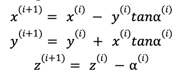
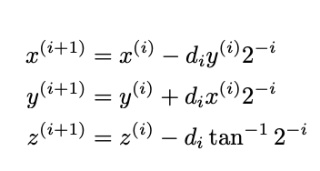
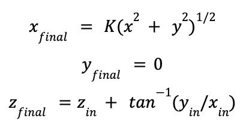
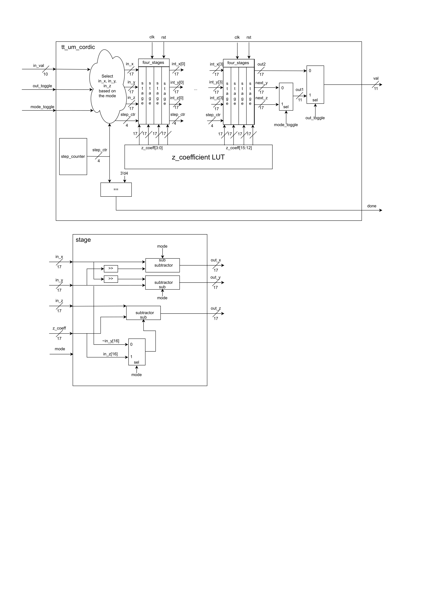
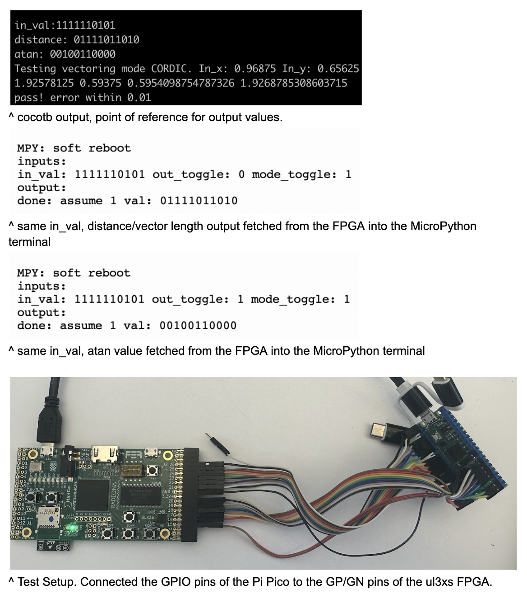

# CORDIC

Thomas Kang
18-224 Spring 2024 Final Tapeout Project

## Overview

CORDIC is a way to calculate complex non-linear functions specifically without the use of expensive multipliers or dividers. There are two modes: vectoring and rotation mode. Vectoring mode returns the arctan and length of a vector(technically this is the distance between (x,y) and (0,0)) while rotation mode returns the cosine and sine of the input radian value. My project can take in either a radian value or a (x,y) coordinate to calculate the non-linear functions.

## CORDIC overview
CORDIC stands for COordinate Rotation DIgital Computer, which is a way to calculate complex non-linear functions. This includes cosine and sine for rotation mode, and magnitude of a vector and arctan of an angle for vectoring mode. CORDIC uses a specific lookup table of values to calculate these without a multiplier or divider to minimize hardware usage.
The CORDIC module takes in an angle and outputs 4 different values each time depending on the specific mode. As mentioned above, the rotation mode gets us an approximation of sin and cosine while the vectoring mode gets us arctan and magnitude. In rotation mode, the way CORDIC calculates this is to iterate over several pseudo-rotations to approximate the rotation of a unit vector. Each CORDIC iteration rotates by a fixed angle, and by choosing specific angles to rotate every time ahead of time, we can avoid using a large amount of hardware on a multiplier. We repeat this process until we can converge the z value into 0.
Below are the equations we are iterating on:

where a^(i)  is the value of alpha at the “i”th iterations. We use specific alpha values so that they are a power of 2.

This replaces the multipliers or dividers with relatively cheaper shifters. The more iterations we have, the more accurate the value we get, and based on the number of iterations, the amount of rotation each iteration has changed as well.

The vectoring mode is slightly different. While doing a very similar mathematical calculation for each step, we are aiming to force y into 0 after 16 steps. After 16 stages, we eventually get the following values instead of cosine and sine:

There are a couple of differences in operating in vectoring mode. First, in each iteration, we use on y’s sign instead of z’s sign to add or subtract from x/y/z. Also, instead of simply taking in an angle, we would be inputting x and y coordinates, and the initial value then automatically becomes 0.

## How my specific implementation works

To save space but also get a faster clock, I will divide the series of calculations into 16 stages, and 4 stages will be merged into one large stage. While I initially had 16 stages of the pipeline, this was using too much area due to registers at each stage. Thus, This design contains 4 large stages of the pipeline.

Each small stage simply computes the addition or subtraction of in_x/shifted in_y, in_y/shifted in_x, and in_z/z_coefficient. Whether it subtracts or adds, denoted by the d_i in the diagram above, depends on the mode_toggle as well as the sign of in_y and in_z of that specific stage. The large stage contains 4 of these smaller stages, and each out_x/y/z is the in_x/y/z of the next stage. Depending on the mode_toggle value that chooses between rotation mode and vectoring mode, in_x, in_y, and in_z in the first stage differs. 
After going through 16 stages in total, depending on the out_toggle and mode_toggle, one can choose which value to generate. The rotation mode generates the cosine and sine of the input radian value. Vectoring generates arctan(y_in/x_in) or K(x_in^2 + y_in^2)^1/2 where K is a pre-defined value of 1.646760. Below is the datapath for the top level tt_um_cordic module as well as a singular stage.

## Inputs/Outputs

### INPUTS:
**Clk**: clock signal of the design\
**rst**: resets the entire design. Each time one wants to change the mode or change the input value, you would need to assert this after changing the inputs accordingly.\
**10-bit in_val**: A 3-bit decimal, 7-bit fraction radian value for rotation mode, while it is 2 5-bit fraction x and y coordinate values concatenated for vectoring mode.\
**1-bit out_toggle**: toggles between different outputs. Cosine vs sine OR arctan(y_in/x_in) vs K(x_in^2 + y_in^2)^1/2\
**1-bit mode_toggle**: 0 means rotation mode, 1 means vectoring mode

### OUTPUTS:
**1-bit done**: Denotes when the calculation is done. \
**11-bit val**: Output of the design that can be changed by out_toggle or mode_toggle. 2-bit decimal and 9-bit fraction weighted two’s complement value. 

## Design Testing / Bringup

**Simulation:**
One can test the design using the provided cocotb testbench in testing/cordic_tb.py and testing/testbench.mk. Simply by running “make -Bf testbench.mk,” it will output the input and output of each test case, and whether it's a fail, partial pass, or pass. The cocotb testbench sweeps the entire input range, 0~1.50 radians by 0.01 steps for rotation mode, and 1/32 ~ 31/32 x/y coordinate values for vectoring mode. Due to the limited number of input bits, the vectoring mode saw some output values that weren’t as accurate. Those that are within 0.01 are full passes, within 0.1 are partial passes, and anything exceeding that is a fail. There are 30x30 + 150 = 1050 total test cases, and there were 9 partial passes and 27 fails. For rotation mode, everything was within 0.01 error rate, giving them all a pass. For more information, take a look at testing/cordic_tb.py and testing/testbench.mk. Input_test_mode0 tests rotation mode, and input_test_mode1 tests vectoring mode.

**FPGA:**
One can also test the design using a microcontroller and an FPGA. I have specifically used an ulx3s FPGA board with a Pi Pico. The sample micropython code is testing/fpga_test_simple.py, and the constraints.lpf file was used to load the design on a ulx3s FPGA board. Simply hook up the Pi Pico(or any microcontroller) with the FPGA and initiate the output and input GPIO pins. Once that’s done, set the input to whatever you want, reset the design, and you should see the output of the design being fetched by the Python script on the microcontroller. Every time you want to change the input value or mode, you will have to reset the design in between. Below is a picture of an FPGA's output fetched on the Microcontroller's Thonny terminal.

**Bringup:**
Once the chip is manufactured, it can be tested with a microcontroller as well, similar to the FPGA. Hook up the outputs of the chip to the micro controller's GPIO as input, and input of the chip as the microcontroller's GPIO output. Once that's done, set the inputs to a desired value, reset the design, and fetch the value on the output. Remember to reset the design every time the input values change. As mentioned in the simulation section, the input for rotation mode ranges to 0~1.50 radians, which is 'b000_0000_000 ~ 'b001_1000_000 in binary. For vectoring mode, the input range is 1/32 ~ 31/32 for x and y respectively, and the 5 upper bits of in_val is x while the lower 5 bits are y. Thus, 'b00000_00000 ~ 'b11111_11111 is the range. Refer to the cocotb simulation output to verify correctness of the output from the chip. 

## Future Work
In case there are more pins accessible, it would be great to try increasing the x and y input width to get better precision on the vectoring mode output. 
Without an increase in pins, one could try these to improve the design:
1) Make the design take in x and y input over multiple cycles to get a wider input value
2) Have internal processing that enables the rotation mode to take in multiple quadrant radian values. 
And others as well.

## References
web.cs.ucla.edu/digital_arithmetic/files/ch11.pdf

